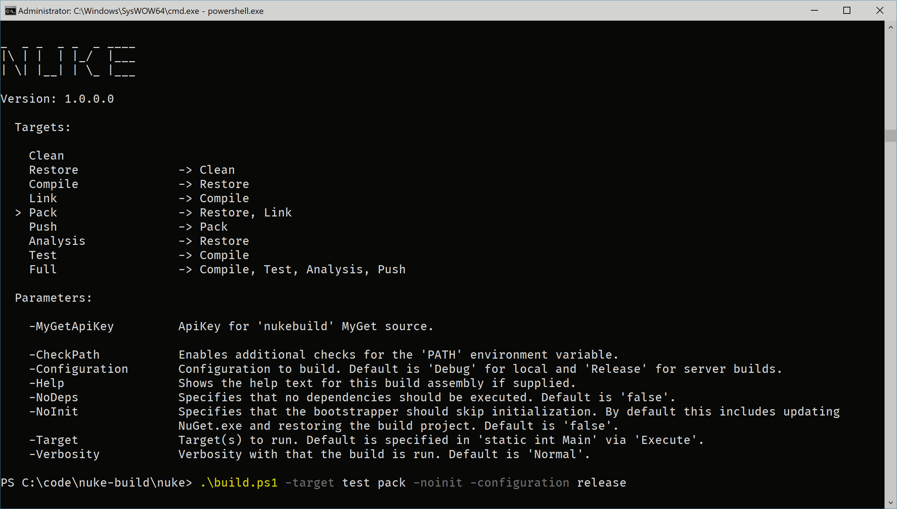

# Command-Line

We engage by providing an improved command-line experience that also tightly integrates with custom build requirements.

## Help Text

When calling `build -help` we provide a help text with information about all defined targets along with their dependencies (including marking the default target) as well as all parameters that the build can accept (custom parameters come first).



By default, value collections like `-target` can be passed separated with space. Switches like `-nodeps` or `-noinit` can passed as single argument or with `false` or `true` appended.

## Custom Parameters

We allow to define custom parameters via fields or properties:

```csharp
[Parameter("ApiKey for 'nukebuild' MyGet source.")]
readonly string MyGetApiKey;

[Parameter(Separator = "+")]
public string[] Items { get; } = { "Default" };
```

By utilizing the `[Parameter]` attribute we provide the following features:

- **Abstraction:** Resolving data is done by first looking up command-line arguments and then environment variables.
- **Data types:** Parsing works for `boolean`, `string`, `int`, enumerations and other numeric types, as well as collections of them.
- **Default values:** If no data could be retrieved, both fields and properties will keep their default values.
- **Custom separator:** Via `ParameterAttribute.Separator` the default separator can be changed.
- **Fast fail:** Targets can define parameter requirements via `.Requires(() => MyGetApiKey)` which are checked prior to execution.

If this declarative approach is not applicable, we still provide `EnvironmentInfo`, which provides [all the methods](/api/Nuke.Core.EnvironmentInfo.html#methods) to resolve data as parameter, from command-line arguments or from environment variables.

## Future Work

In the future, we plan to improve on three aspects:

1. There is currently no validation for checking if all _required_ parameters have been passed, or even _unsupported_ parameters have been passed.
2. Provide information about the parameter type. For instance, whether it is a switch or accepts multiple values.
3. Every time we call `./build.ps1 -help` or `./build.sh -help`, it is required to compile the build project. We might be able to solve this issue by providing a custom post-build target, that will write all the necessary information in both `build.ps1` and `build.sh`.

