<!-- MAIN JUMBOTRON -->

  

    

        <h1>/njuːk/</h1>
<!--

  <defs>

    <filter id="filter">
        <feFlood flood-color="red" result="flood1" />
        <feFlood flood-color="limegreen" result="flood2" />
      <feOffset in="SourceGraphic" dx="3" dy="0" result="off1a"/>
      <feOffset in="SourceGraphic" dx="2" dy="0" result="off1b"/>
      <feOffset in="SourceGraphic" dx="-3" dy="0" result="off2a"/>
      <feOffset in="SourceGraphic" dx="-2" dy="0" result="off2b"/>
        <feComposite in="flood1" in2="off1a" operator="in"  result="comp1" />
        <feComposite in="flood2" in2="off2a" operator="in" result="comp2" />

        <feMerge x="0" width="100%" result="merge1">
        <feMergeNode in = "black" />
        <feMergeNode in = "comp1" />
        <feMergeNode in = "off1b" />

        <animate 
          attributeName="y" 
            id = "y"
            dur ="4s"
            
            values = '104px; 104px; 30px; 105px; 30px; 2px; 2px; 50px; 40px; 105px; 105px; 20px; 6ßpx; 40px; 104px; 40px; 70px; 10px; 30px; 104px; 102px'

            keyTimes = '0; 0.362; 0.368; 0.421; 0.440; 0.477; 0.518; 0.564; 0.593; 0.613; 0.644; 0.693; 0.721; 0.736; 0.772; 0.818; 0.844; 0.894; 0.925; 0.939; 1'

            repeatCount = "indefinite" />
 
        <animate attributeName="height" 
            id = "h" 
            dur ="4s"
            
            values = '10px; 0px; 10px; 30px; 50px; 0px; 10px; 0px; 0px; 0px; 10px; 50px; 40px; 0px; 0px; 0px; 40px; 30px; 10px; 0px; 50px'

            keyTimes = '0; 0.362; 0.368; 0.421; 0.440; 0.477; 0.518; 0.564; 0.593; 0.613; 0.644; 0.693; 0.721; 0.736; 0.772; 0.818; 0.844; 0.894; 0.925; 0.939; 1'

            repeatCount = "indefinite" />
        </feMerge>
      

      <feMerge x="0" width="100%" y="60px" height="65px" result="merge2">
        <feMergeNode in = "black" />
        <feMergeNode in = "comp2" />
        <feMergeNode in = "off2b" />

        <animate attributeName="y" 
            id = "y"
            dur ="4s"
            values = '103px; 104px; 69px; 53px; 42px; 104px; 78px; 89px; 96px; 100px; 67px; 50px; 96px; 66px; 88px; 42px; 13px; 100px; 100px; 104px;' 

            keyTimes = '0; 0.055; 0.100; 0.125; 0.159; 0.182; 0.202; 0.236; 0.268; 0.326; 0.357; 0.400; 0.408; 0.461; 0.493; 0.513; 0.548; 0.577; 0.613; 1'

            repeatCount = "indefinite" />
 
        <animate attributeName="height" 
            id = "h"
            dur = "4s"
          
          values = '0px; 0px; 0px; 16px; 16px; 12px; 12px; 0px; 0px; 5px; 10px; 22px; 33px; 11px; 0px; 0px; 10px'

            keyTimes = '0; 0.055; 0.100; 0.125; 0.159; 0.182; 0.202; 0.236; 0.268; 0.326; 0.357; 0.400; 0.408; 0.461; 0.493; 0.513;  1'
             
            repeatCount = "indefinite" />
        </feMerge>
      
      <feMerge>
        <feMergeNode in="SourceGraphic" />  

        <feMergeNode in="merge1" /> 
      <feMergeNode in="merge2" />

        </feMerge>
      </filter>

  </defs>

<g>
  <text x="0" y="80">/njuːk/</text>
</g>
</svg>
-->
        <ol class="definition">
          <li>A cross-platform <a href="https://martinfowler.com/articles/continuousIntegration.html#AutomateTheBuild">build automation</a> system with C# DSL.</li>
          <li>An approach to embrace existing IDE tooling.</li>
          <li>A state where everyone in a team is able to manage and change the build.</li>
        </ol>
        

        <a class="btn btn-default btn-md" href="/getting-started.html" role="button">Read more</a>
        <a class="btn btn-default btn-md" href="https://www.youtube.com/watch?v=7gEqxzD6hbs" role="button">Watch more</a>
      

  

<!-- FULL IDE SUPPORT -->

  

    

      <h2> Native IDE support</h2>
      
Build projects are simple C# console applications - no pre-processing or scripting involved, and <a id="solution-view">part of your solution</a>! That means all the powerful IDE features that we love - like <a id="code-completion">code-completion</a>, refactorings and formatting - will work without any extensions. Targets are defined as <em>expression-bodied properties</em>, so you might want to say good-bye to magic strings! But most importantly, <a id="debugging">debugging</a> is available just as you know it. There is no more need to debug code by writing output to the console!

    

    

      

        <ol class="carousel-indicators">
          <li data-target="#ide-support-carousel" data-slide-to="0" class="active"></li>
          <li data-target="#ide-support-carousel" data-slide-to="1"></li>
          <li data-target="#ide-support-carousel" data-slide-to="2"></li>
        </ol>
        

          
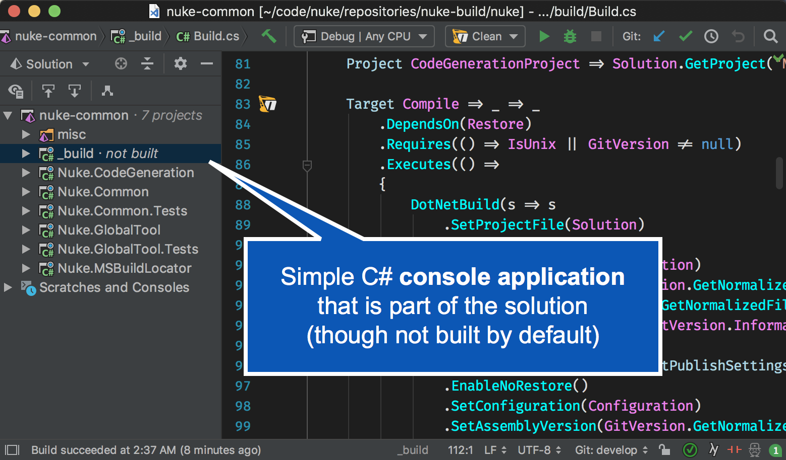

          
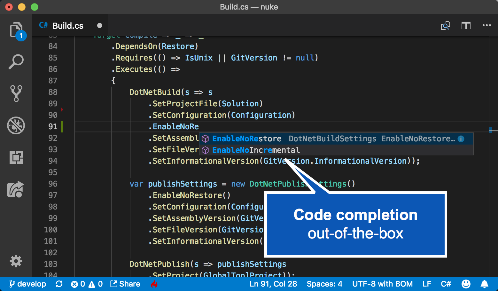

          
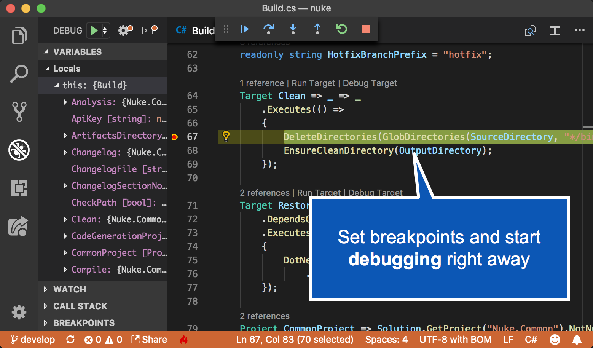

        

        <a class="left carousel-control" href="#ide-support-carousel" role="button" data-slide="prev">
          
          Previous
        </a>
        <a class="right carousel-control" href="#ide-support-carousel" role="button" data-slide="next">
          
          Next
        </a>
      

    

  

<!-- BOOTSTRAPPING JUMBOTRON -->

  

    

      <h2>Supports .NET Core, .NET Framework and Mono!</h2>
      
      
      
    

  

<!-- EXTENDED TOOLING -->

  

    

      <h2> Extended Tooling</h2>
      
The .NET ecosystem is just a wonderful place. Although build projects integrate natively into existing tooling, we are not stopping there! A <a id="global-tool">global tool</a> can be installed, that assists with the setup and invocation of builds by a single <code>nuke</code> command. Also extensions for VSCode, Rider and ReSharper are available that enhance the <a id="command-palette">command palette</a> and the <a id="alt-enter">Alt-Enter menu</a> to execute build targets in the most convenient way!

    

    

      

        <ol class="carousel-indicators">
          <li data-target="#global-extension-carousel" data-slide-to="0" class="active"></li>
          <li data-target="#global-extension-carousel" data-slide-to="1"></li>
          <li data-target="#global-extension-carousel" data-slide-to="2"></li>
        </ol>
        

          
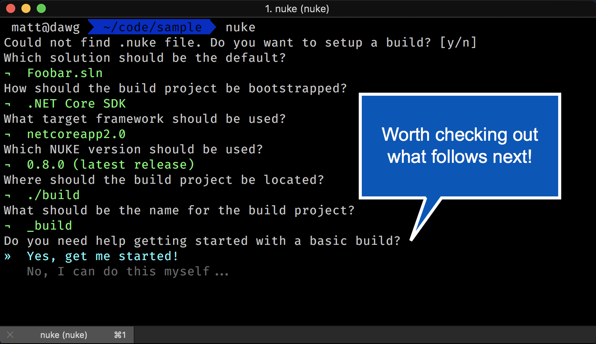

          
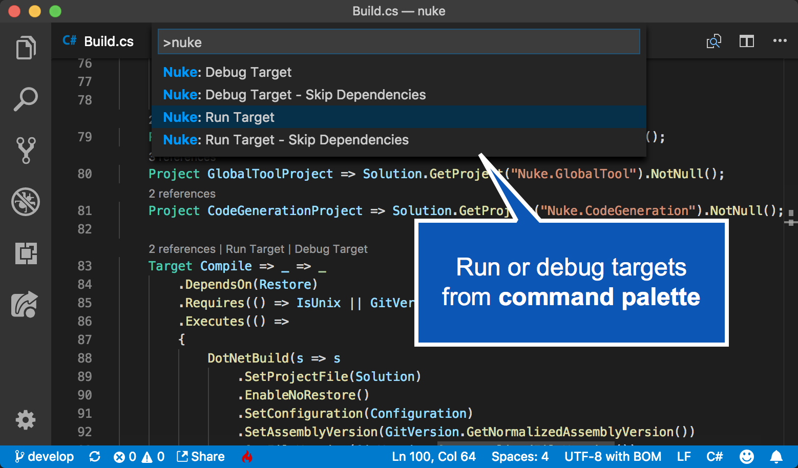

          
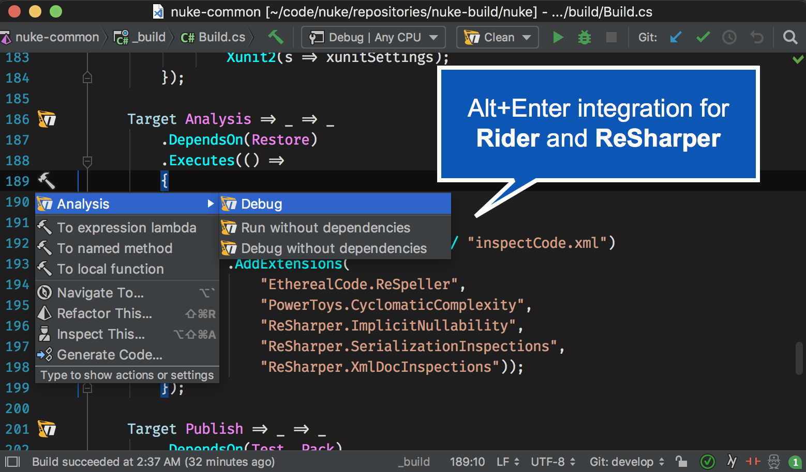

        

        <a class="left carousel-control" href="#global-extension-carousel" role="button" data-slide="prev">
          
          Previous
        </a>
        <a class="right carousel-control" href="#global-extension-carousel" role="button" data-slide="next">
          
          Next
        </a>
      

    

  

<!-- WHAT ELSE JUMBOTRON -->

  

    

      <h2>Wonder which tools we support?</h2>
      <h2>...</h2>
      <h2>That's the best part!</h2>
    

  

<!-- CODE-GENERATION -->

  

    

      <h2> Code-Generation</h2>
      
Execution APIs for third-party command-line tools are based on data from <a id="references">official references</a>. We're extracing information like argument types, formatting and others into so-called <a id="metadata">specification files</a>. These files are then processed by a code-generator that generates a rich and consistent fluent API. Official help texts are shown in IntelliSense! And no more need to worry about escaping or separators! Check out our addons for <a href="https://github.com/nuke-build/azure/tree/master/src/Nuke.Azure/Generated">Azure CLI</a> and <a href="https://github.com/nuke-build/docker/blob/master/src/Nuke.Docker/Generated/Docker.Generated.cs">Docker</a>, which are even automatically updated whenever a new version of the related tool is published.

    

    

      

        <ol class="carousel-indicators">
          <li data-target="#code-generation-carousel" data-slide-to="0" class="active"></li>
          <li data-target="#code-generation-carousel" data-slide-to="1"></li>
          <li data-target="#code-generation-carousel" data-slide-to="2"></li>
        </ol>
        

          
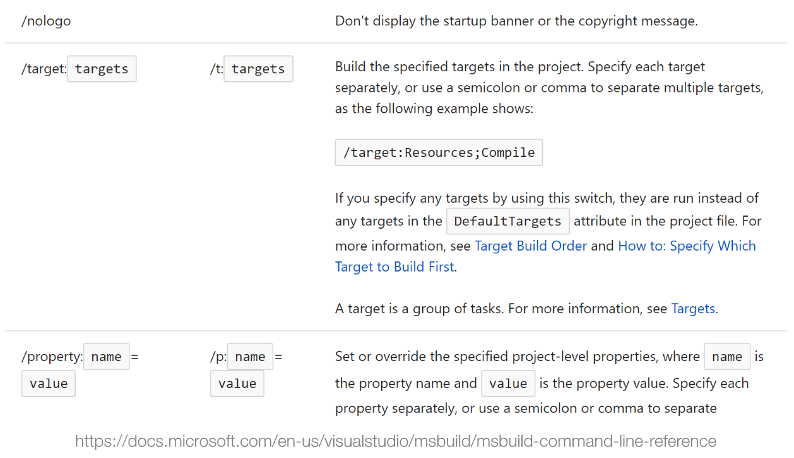

          
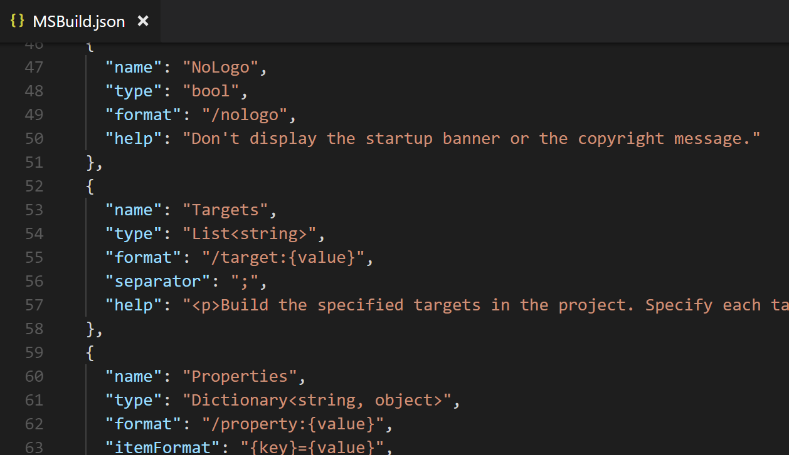

          
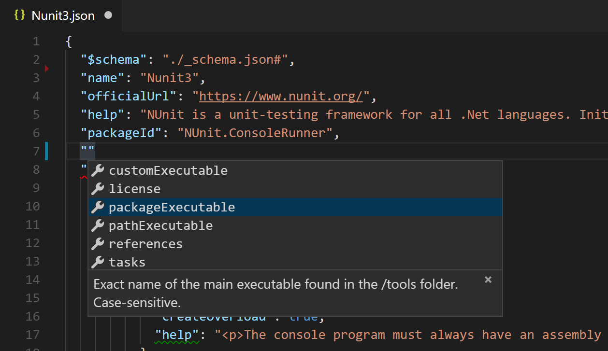

        

        <a class="left carousel-control" href="#code-generation-carousel" role="button" data-slide="prev">
          
          Previous
        </a>
        <a class="right carousel-control" href="#code-generation-carousel" role="button" data-slide="next">
          
          Next
        </a>
      

    

  

<!-- WHAT ELSE JUMBOTRON -->

  

    

      <h2>What else?</h2>
      <h2>...</h2>
      <h2>A lot more!</h2>
    

  

<!-- FEATURE LIST -->

  

    

      <h2> Value Injections</h2>
      
Fields can be marked with different attributes to get their value injected prior to execution. For instance, <code>[Parameter]</code> retrieves the value from command-line arguments and environment variables with the same name as the field.

      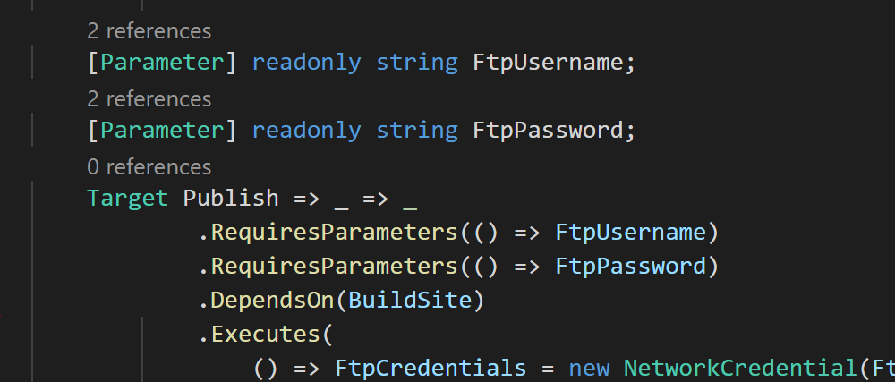
    

    

      <h2> Path Construction</h2>
      
Absolute and relative paths can be constructed using the <code>/</code> division operator, which will automatically adjust the directory separator to the underlying OS. If required, paths can also be casted to match other platforms.

      
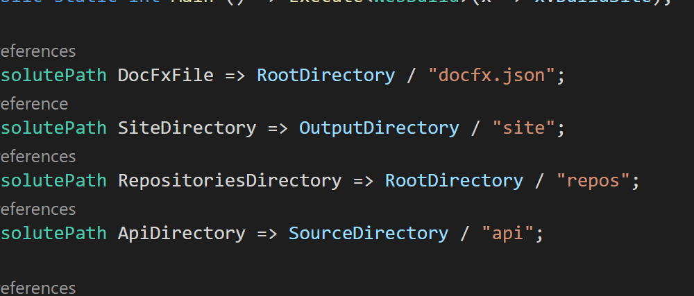

    

  

  

    

      <h2> Default Settings</h2>
      
Common metadata, like <em>solution file</em> or <em>repository url</em>, and best-practice settings, like <em>custom loggers</em> or <em>coverage filters</em>, are automatically loaded into <code>DefaultSettings</code> and can be used to invoke tools more efficiently.

      

        <ol class="carousel-indicators">
          <li data-target="#default-settings-carousel" data-slide-to="0" class="active"></li>
          <li data-target="#default-settings-carousel" data-slide-to="1"></li>
        </ol>
        

          
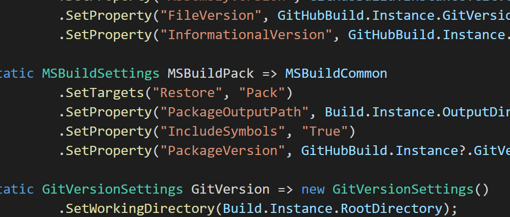

          

        

        <a class="left carousel-control" href="#default-settings-carousel" role="button" data-slide="prev">
          
          Previous
        </a>
        <a class="right carousel-control" href="#default-settings-carousel" role="button" data-slide="next">
          
          Next
        </a>
      

    

    

      <h2> Adaptive Logging</h2>
      
Log output is optimized for the best readability. Depending on the current environment the build is running on, target captions will be printed in various figlet fonts or utilize service messages if supported by the CI system.

      

        <ol class="carousel-indicators">
          <li data-target="#adaptive-logging-carousel" data-slide-to="0" class="active"></li>
          <li data-target="#adaptive-logging-carousel" data-slide-to="1"></li>
          <li data-target="#adaptive-logging-carousel" data-slide-to="2"></li>
        </ol>
        

          

          
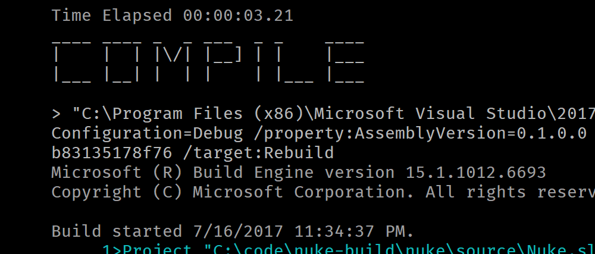

          
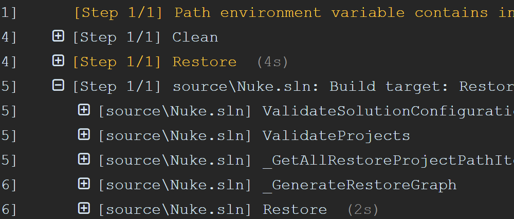

        

        <a class="left carousel-control" href="#adaptive-logging-carousel" role="button" data-slide="prev">
          
          Previous
        </a>
        <a class="right carousel-control" href="#adaptive-logging-carousel" role="button" data-slide="next">
          
          Next
        </a>
      

    

  

