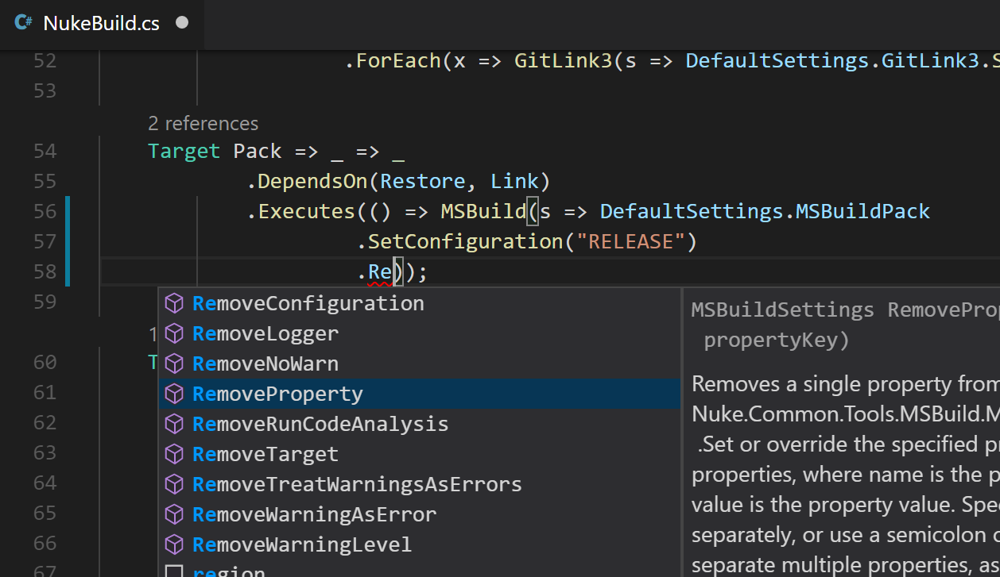
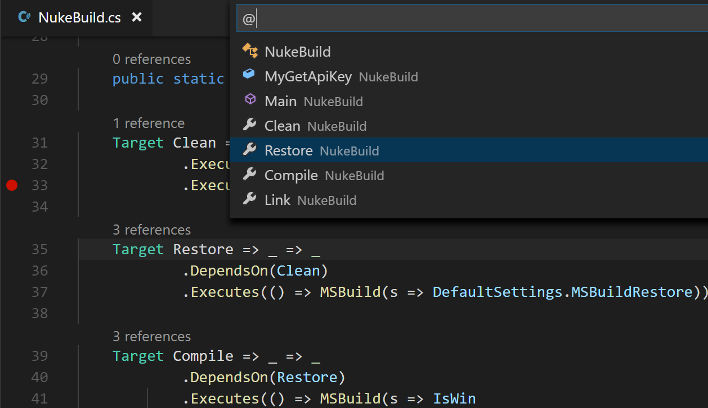
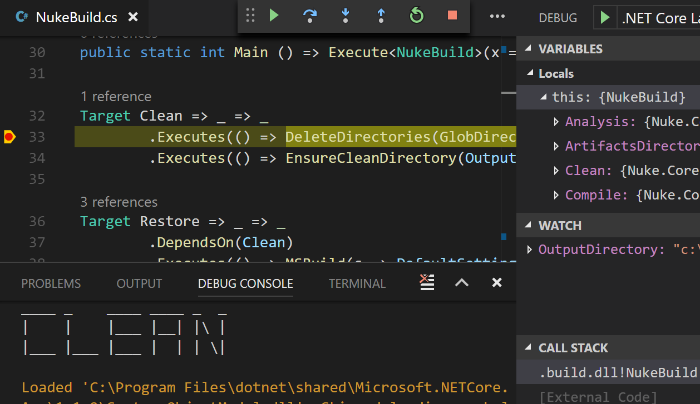

<!-- MAIN JUMBOTRON -->

  

    

        <h1>/njuːk/</h1>
<!--

  <defs>

    <filter id="filter">
        <feFlood flood-color="red" result="flood1" />
        <feFlood flood-color="limegreen" result="flood2" />
      <feOffset in="SourceGraphic" dx="3" dy="0" result="off1a"/>
      <feOffset in="SourceGraphic" dx="2" dy="0" result="off1b"/>
      <feOffset in="SourceGraphic" dx="-3" dy="0" result="off2a"/>
      <feOffset in="SourceGraphic" dx="-2" dy="0" result="off2b"/>
        <feComposite in="flood1" in2="off1a" operator="in"  result="comp1" />
        <feComposite in="flood2" in2="off2a" operator="in" result="comp2" />

        <feMerge x="0" width="100%" result="merge1">
        <feMergeNode in = "black" />
        <feMergeNode in = "comp1" />
        <feMergeNode in = "off1b" />

        <animate 
          attributeName="y" 
            id = "y"
            dur ="4s"
            
            values = '104px; 104px; 30px; 105px; 30px; 2px; 2px; 50px; 40px; 105px; 105px; 20px; 6ßpx; 40px; 104px; 40px; 70px; 10px; 30px; 104px; 102px'

            keyTimes = '0; 0.362; 0.368; 0.421; 0.440; 0.477; 0.518; 0.564; 0.593; 0.613; 0.644; 0.693; 0.721; 0.736; 0.772; 0.818; 0.844; 0.894; 0.925; 0.939; 1'

            repeatCount = "indefinite" />
 
        <animate attributeName="height" 
            id = "h" 
            dur ="4s"
            
            values = '10px; 0px; 10px; 30px; 50px; 0px; 10px; 0px; 0px; 0px; 10px; 50px; 40px; 0px; 0px; 0px; 40px; 30px; 10px; 0px; 50px'

            keyTimes = '0; 0.362; 0.368; 0.421; 0.440; 0.477; 0.518; 0.564; 0.593; 0.613; 0.644; 0.693; 0.721; 0.736; 0.772; 0.818; 0.844; 0.894; 0.925; 0.939; 1'

            repeatCount = "indefinite" />
        </feMerge>
      

      <feMerge x="0" width="100%" y="60px" height="65px" result="merge2">
        <feMergeNode in = "black" />
        <feMergeNode in = "comp2" />
        <feMergeNode in = "off2b" />

        <animate attributeName="y" 
            id = "y"
            dur ="4s"
            values = '103px; 104px; 69px; 53px; 42px; 104px; 78px; 89px; 96px; 100px; 67px; 50px; 96px; 66px; 88px; 42px; 13px; 100px; 100px; 104px;' 

            keyTimes = '0; 0.055; 0.100; 0.125; 0.159; 0.182; 0.202; 0.236; 0.268; 0.326; 0.357; 0.400; 0.408; 0.461; 0.493; 0.513; 0.548; 0.577; 0.613; 1'

            repeatCount = "indefinite" />
 
        <animate attributeName="height" 
            id = "h"
            dur = "4s"
          
          values = '0px; 0px; 0px; 16px; 16px; 12px; 12px; 0px; 0px; 5px; 10px; 22px; 33px; 11px; 0px; 0px; 10px'

            keyTimes = '0; 0.055; 0.100; 0.125; 0.159; 0.182; 0.202; 0.236; 0.268; 0.326; 0.357; 0.400; 0.408; 0.461; 0.493; 0.513;  1'
             
            repeatCount = "indefinite" />
        </feMerge>
      
      <feMerge>
        <feMergeNode in="SourceGraphic" />  

        <feMergeNode in="merge1" /> 
      <feMergeNode in="merge2" />

        </feMerge>
      </filter>

  </defs>

<g>
  <text x="0" y="80">/njuːk/</text>
</g>
</svg>
-->
        <ol class="definition">
          <li>A cross-platform <a href="https://martinfowler.com/articles/continuousIntegration.html#AutomateTheBuild">build automation</a> system with C# DSL.</li>
          <li>An approach to embrace existing IDE tooling.</li>
          <li>A state where everyone in a team is able to manage and change the build.</li>
        </ol>
        

        <a class="btn btn-default btn-md" href="/getting-started.html" role="button">Read more</a>
        <a class="btn btn-default btn-md" href="https://vimeo.com/221165782" role="button">Watch more</a>
      

  

<!-- FULL IDE SUPPORT -->

  

    

      <h2> Full IDE support</h2>
      
Builds are full-fledged C# projects. No preprocessing involved! That means all the powerful IDE features like <a id="auto-completion">auto-completion</a>, refactorings and formatting will celebrate their comeback. Targets are defined as <em>expression-bodied properties</em> and therefore provide <a id="navigation">superior navigation</a>. Also target dependency definitions and rename refactorings benefit from this approach. Ultimately, <a id="debugging">debugging</a> is available just as you know it. No more writing debug output to the console!

    

    

      

        <ol class="carousel-indicators">
          <li data-target="#ide-support-carousel" data-slide-to="0" class="active"></li>
          <li data-target="#ide-support-carousel" data-slide-to="1"></li>
          <li data-target="#ide-support-carousel" data-slide-to="2"></li>
        </ol>
        

          

          

          

        

        <a class="left carousel-control" href="#ide-support-carousel" role="button" data-slide="prev">
          
          Previous
        </a>
        <a class="right carousel-control" href="#ide-support-carousel" role="button" data-slide="next">
          
          Next
        </a>
      

    

  

<!-- BOOTSTRAPPING JUMBOTRON -->

  

    

      <h2>Bootstrapping for all platforms included.</h2>
      
      
      
    

  

<!-- FEATURE LIST -->

  

    

      <h2> Value Injections</h2>
      
Fields can be marked with different attributes to get their value injected prior to execution. For instance, <code>[Parameter]</code> retrieves the value from command-line arguments and environment variables with the same name as the field.

      
    

    

      <h2> Path Construction</h2>
      
Absolute and relative paths can be constructed using the <code>/</code> or <code>+</code> operators, which will automatically adjust the directory separator to the underlying OS. If required, paths can also be casted to match other platforms.

      

    

  

  

    

      <h2> Default Settings</h2>
      
Common metadata, like <em>solution file</em> or <em>repository url</em>, and best-practice settings, like <em>custom loggers</em> or <em>coverage filters</em>, are automatically loaded into <code>DefaultSettings</code> and can be used to invoke tools more efficiently.

      

        <ol class="carousel-indicators">
          <li data-target="#default-settings-carousel" data-slide-to="0" class="active"></li>
          <li data-target="#default-settings-carousel" data-slide-to="1"></li>
        </ol>
        

          

          

        

        <a class="left carousel-control" href="#default-settings-carousel" role="button" data-slide="prev">
          
          Previous
        </a>
        <a class="right carousel-control" href="#default-settings-carousel" role="button" data-slide="next">
          
          Next
        </a>
      

    

    

      <h2> Adaptive Logging</h2>
      
Log output is optimized for the best readability. Depending on the current environment the build is running on, target captions will be printed in various figlet fonts or utilize service messages if supported by the CI system.

      

        <ol class="carousel-indicators">
          <li data-target="#adaptive-logging-carousel" data-slide-to="0" class="active"></li>
          <li data-target="#adaptive-logging-carousel" data-slide-to="1"></li>
          <li data-target="#adaptive-logging-carousel" data-slide-to="2"></li>
        </ol>
        

          

          

          

        

        <a class="left carousel-control" href="#adaptive-logging-carousel" role="button" data-slide="prev">
          
          Previous
        </a>
        <a class="right carousel-control" href="#adaptive-logging-carousel" role="button" data-slide="next">
          
          Next
        </a>
      

    

  

<!-- CODE GENERATION -->

  <h2> Code Generation</h2>
  
Implementing support for CLI tools is crucial for build systems. We provide a code generator to solve this problem! It works based on <a href="https://github.com/nuke-build/tools">JSON definition files</a> which are usually <a href="https://vimeo.com/221086461">written within several minutes</a>. As output we generate a comprehensive structure of entry methods, data classes, enumerations and extension methods. Not only does this structure implement the builder pattern; we also provide extension points for more complicated implementations as well as specialized methods for manipulating <em>boolean</em>, <em>list</em> and other argument types.

  

    

      <ul class="nav nav-tabs">
        <li class="active"><a href="#input" data-toggle="tab">Input</a></li>
        <li class="dropdown">
          <a href="#" data-toggle="dropdown">Generated Code </a>
          <ul class="dropdown-menu" role="menu">
            <li><a href="#entry-methods" data-toggle="tab">Entry Methods</a></li>
            <li><a href="#data-classes" data-toggle="tab">Data Classes</a></li>
            <li><a href="#extensions" data-toggle="tab">Extensions</a></li>
          </ul>
        </li>
        <li><a href="#custom" data-toggle="tab">Custom Code</a></li>
      </ul>
    

    

      

        
<code data-gist-id="1173999afc77e94fb10065c44ea6550c" data-gist-hide-footer="true"></code>

        
<code data-gist-id="cbd0e26a3a98e6d5d76c92fc10f9f8df" data-gist-hide-footer="true"></code>

        
<code data-gist-id="4cd3a4b1724b5be1e29a8ca5b72fbc52" data-gist-hide-footer="true"></code>

        
<code data-gist-id="fc63dcf3df9f6d0587cee7d48d2afca2" data-gist-hide-footer="true"></code>

        
<code data-gist-id="0f58468d7aeb41d544bbf62d86381608" data-gist-hide-footer="true"></code>

      

    

  

